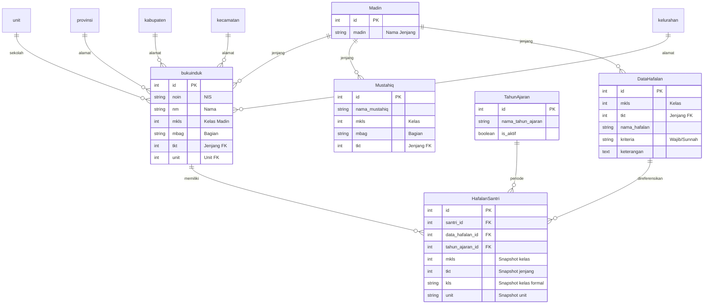

# 📚 Diniyyah Filament

Sistem Informasi Manajemen Madrasah Diniyyah berbasis web yang dibangun menggunakan **Laravel 10** dan **Filament 3**. Aplikasi ini dirancang untuk membantu pengelolaan data santri, pencatatan hafalan, dan administrasi akademik lembaga pendidikan Diniyyah.

---

## ✨ Fitur Utama

### 📖 Manajemen Hafalan
- **Input Hafalan Santri** — Halaman interaktif untuk mencatat progres hafalan setiap santri dengan sistem checkbox.
- **Klasifikasi Hafalan** — Hafalan dibedakan menjadi **Wajib** dan **Sunnah**, dengan validasi bahwa hafalan Sunnah hanya bisa dicentang setelah seluruh hafalan Wajib diselesaikan.
- **Data Hafalan per Kelas** — Pengaturan daftar hafalan yang harus diselesaikan berdasarkan jenjang (Ula, Wustho, Ulya) dan kelas (1–6).
- **Riwayat Hafalan** — Pencatatan historis kelas, jenjang, dan unit sekolah saat santri menyelesaikan hafalan.
- **Mode Uncek (Admin)** — Fitur khusus untuk membatalkan hafalan yang sudah ditandai tuntas.

### 👤 Manajemen Data Santri
- **Buku Induk** — Database lengkap santri meliputi NIS, nama, tempat/tanggal lahir, nama ayah, unit sekolah, dan alamat lengkap (kelurahan, kecamatan, kabupaten, provinsi).
- **Biodata Otomatis** — Detail biodata santri ditampilkan secara otomatis saat pencarian di halaman input hafalan.

### 🏫 Administrasi Akademik
- **Tahun Ajaran** — Pengelolaan tahun ajaran dengan mekanisme aktivasi (hanya satu tahun ajaran aktif pada satu waktu).
- **Mustahiq (Wali Kelas)** — Pendataan mustahiq per kelas, bagian, dan jenjang Madin.
- **Jenjang Madin** — Mendukung tiga jenjang: Ula, Wustho, dan Ulya.
- **Unit Sekolah** — Pengelolaan unit-unit sekolah formal yang terintegrasi.

---

## 🛠️ Tech Stack

| Komponen       | Teknologi                                      |
|----------------|-------------------------------------------------|
| **Framework**  | [Laravel 10](https://laravel.com)               |
| **Admin Panel**| [Filament 3](https://filamentphp.com)           |
| **PHP**        | >= 8.1                                          |
| **Database**   | MySQL                                           |
| **Frontend**   | Blade, Livewire (via Filament), Vite            |
| **Auth**       | Laravel Sanctum                                 |

---

## 📂 Struktur Proyek

```
diniyyah-filament/
├── app/
│   ├── Filament/
│   │   ├── Pages/
│   │   │   └── InputHafalan.php        # Halaman input hafalan santri
│   │   └── Resources/
│   │       ├── DataHafalanResource.php  # CRUD data hafalan per kelas
│   │       ├── MustahiqResource.php     # CRUD data mustahiq
│   │       └── TahunAjaranResource.php  # Pengelolaan tahun ajaran
│   └── Models/
│       ├── bukuinduk.php                # Model data santri (buku induk)
│       ├── DataHafalan.php              # Model daftar hafalan per kelas
│       ├── HafalanSantri.php            # Model pencatatan hafalan santri
│       ├── Madin.php                    # Model jenjang Madin
│       ├── Mustahiq.php                 # Model wali kelas / mustahiq
│       ├── TahunAjaran.php              # Model tahun ajaran
│       ├── unit.php                     # Model unit sekolah
│       ├── provinsi.php                 # Model data provinsi
│       ├── kabupaten.php                # Model data kabupaten/kota
│       ├── kecamatan.php                # Model data kecamatan
│       └── kelurahan.php                # Model data kelurahan
├── database/
│   └── migrations/                      # Skema database
├── resources/
│   └── views/
│       └── filament/
│           └── components/
│               └── hafalan-list.blade.php  # Komponen tampilan daftar hafalan
└── ...
```

---

## 📊 Entity Relationship



---

## 🚀 Instalasi

### Prasyarat

- PHP >= 8.1
- Composer
- MySQL
- Node.js & NPM

### Langkah-langkah

1. **Clone repository**
   ```bash
   git clone https://github.com/rofiqu210899/diniyyah-filament.git
   cd diniyyah-filament
   ```

2. **Install dependensi PHP**
   ```bash
   composer install
   ```

3. **Install dependensi frontend**
   ```bash
   npm install
   ```

4. **Konfigurasi environment**
   ```bash
   cp .env.example .env
   php artisan key:generate
   ```

5. **Konfigurasi database**

   Edit file `.env` dan sesuaikan pengaturan database:
   ```env
   DB_CONNECTION=mysql
   DB_HOST=127.0.0.1
   DB_PORT=3306
   DB_DATABASE=diniyyah_filament
   DB_USERNAME=root
   DB_PASSWORD=
   ```

6. **Jalankan migrasi database**
   ```bash
   php artisan migrate
   ```

7. **Buat akun admin Filament**
   ```bash
   php artisan make:filament-user
   ```

8. **Build asset frontend**
   ```bash
   npm run build
   ```

9. **Jalankan server**
   ```bash
   php artisan serve
   ```

10. **Akses aplikasi**

    Buka browser dan kunjungi:
    - **Admin Panel**: [http://localhost:8000/admin](http://localhost:8000/admin)

---

## 📋 Alur Penggunaan

1. **Setup Awal**
   - Tambahkan data **Tahun Ajaran** dan aktifkan salah satu.
   - Pastikan data **jenjang Madin** (Ula, Wustho, Ulya) sudah tersedia.
   - Input data **Mustahiq** untuk setiap kelas/bagian.
   - Input daftar **Data Hafalan** per kelas dan jenjang (Wajib/Sunnah).

2. **Input Hafalan Harian**
   - Buka menu **Input Hafalan**.
   - Cari santri berdasarkan NIS atau nama.
   - Biodata santri akan tampil otomatis.
   - Centang hafalan yang sudah diselesaikan.
   - Hafalan **Sunnah** hanya bisa dicentang setelah semua hafalan **Wajib** selesai.

3. **Review & Koreksi**
   - Gunakan **mode uncek** untuk membatalkan hafalan jika terjadi kesalahan.
   - Hafalan hanya bisa diubah pada **tahun ajaran yang sedang aktif**.
   - Data tahun ajaran sebelumnya hanya bisa dilihat (read-only).

---

## 📄 Lisensi

Proyek ini menggunakan framework [Laravel](https://laravel.com) yang dilisensikan di bawah [MIT License](https://opensource.org/licenses/MIT).
