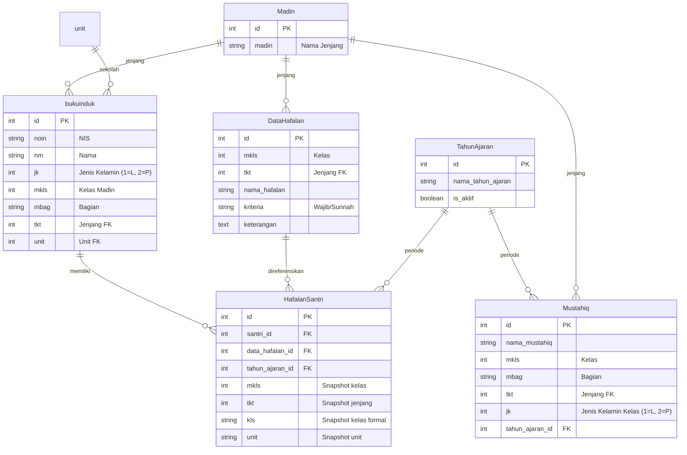

# 📚 Diniyyah Filament

Sistem Informasi Manajemen Madrasah Diniyyah berbasis web yang dibangun menggunakan **Laravel 10** dan **Filament 3**. Aplikasi ini dirancang untuk membantu pengelolaan data santri, pencatatan hafalan, administrasi akademik, dan pelaporan statistik progres hafalan.

---

## ✨ Fitur Utama

### 📖 Manajemen Hafalan
- **Input Hafalan Santri** — Halaman interaktif untuk mencatat progres hafalan setiap santri dengan sistem checkbox.
- **Klasifikasi Hafalan** — Hafalan dibedakan menjadi **Wajib** dan **Sunnah**, dengan validasi bahwa hafalan Sunnah hanya bisa dicentang setelah seluruh hafalan Wajib diselesaikan.
- **Data Hafalan per Kelas** — Pengaturan daftar hafalan yang harus diselesaikan berdasarkan jenjang (Ula, Wustho, Ulya) dan kelas (1–6).
- **Riwayat Hafalan & Penguncian Kelas** — Pencatatan historis kelas, jenjang, dan unit sekolah saat santri menyelesaikan hafalan. Kelas santri pada tahun ajaran berjalan otomatis dikunci apabila sudah memiliki riwayat setoran untuk mencegah tumpang tindih data.
- **Mode Uncek (Admin)** — Fitur khusus untuk membatalkan hafalan yang sudah ditandai tuntas.

### 👤 Manajemen Data Santri
- **Buku Induk** — Database lengkap santri meliputi NIS, nama, jenis kelamin, tempat/tanggal lahir, nama ayah, unit sekolah, dan alamat lengkap.
- **Biodata Otomatis** — Detail biodata santri ditampilkan secara otomatis saat pencarian di halaman input hafalan, termasuk filter jenis kelamin kelas yang sesuai.

### 🏫 Administrasi Akademik
- **Tahun Ajaran** — Pengelolaan tahun ajaran dengan mekanisme aktivasi (hanya satu tahun ajaran aktif pada satu waktu).
- **Auto-Deaktivasi Periode** — Sistem secara otomatis menonaktifkan tahun ajaran berjalan apabila sudah melewati akhir periode (30 Juni) pada saat pengguna login ke sistem.
- **Mustahiq (Wali Kelas) Per Tahun Ajaran** — Pendataan wali kelas per tahun ajaran yang fleksibel. Mustahiq dipetakan berdasarkan kelas, bagian, tingkatan, dan **jenis kelamin kelas (Putra/Putri)**.
- **Jenjang Madin** — Mendukung tiga jenjang utama: Ula, Wustho, dan Ulya.

### 📊 Laporan Rekapitulasi (Unduh Excel)
- **Unduh Rekap Per Tingkat** — Fitur mengekspor laporan pencapaian hafalan kelas ke file Excel menggunakan **Laravel Excel**.
- **Multi-Sheet & Tabel Mandiri** — File Excel terbagi menjadi sheet tingkatan (ULA, Wustho, Ulya) dengan sub-tabel terpisah untuk masing-masing kelas (Kelas 1, Kelas 2, dst.).
- **Header Kolom Dinamis** — Nama hafalan pada kolom tabel menyesuaikan secara dinamis dengan target hafalan kelas tersebut (tidak ada kolom kosong tak berguna).
- **Statistik & Progres Kelas** — Menampilkan jumlah santri, nilai rata-rata kelas, jumlah santri tuntas wajib (Point Wajib), tuntas sunnah (Poin Sunnah), dan persentase progres kelas.
- **Optimasi Kinerja (Bebas N+1)** — Query data teroptimasi menggunakan eager loading dan pemrosesan dalam memori (in-memory) untuk rendering laporan yang sangat cepat dan ringan.

---

## 🛠️ Tech Stack

| Komponen       | Teknologi                                      |
|----------------|-------------------------------------------------|
| **Framework**  | [Laravel 10](https://laravel.com)               |
| **Admin Panel**| [Filament 3](https://filamentphp.com)           |
| **Excel Engine**| [Laravel Excel 3.1](https://laravel-excel.com) |
| **PHP**        | >= 8.1                                          |
| **Database**   | MySQL                                           |
| **Frontend**   | Blade, Livewire (via Filament), Vite            |
| **Waktu & Lokasi**| Asia/Jakarta (WIB), Locale: ID (Indonesia)   |

---

## 📂 Struktur Proyek

```
diniyyah-filament/
├── app/
│   ├── Console/
│   │   └── Commands/
│   │       └── DeactivateTahunAjaran.php # Command manual penonaktifan TA
│   ├── Exports/
│   │   ├── RekapPertingkatanExport.php   # Driver export multi-sheet
│   │   └── RekapPertingkatanSheet.php    # Logger & kalkulator data per sheet
│   ├── Filament/
│   │   ├── Pages/
│   │   │   ├── InputHafalan.php          # Halaman input hafalan santri
│   │   │   └── Rekapitulasi.php          # Halaman filter & download rekap
│   │   └── Resources/
│   │       ├── DataHafalanResource.php    # CRUD daftar hafalan per kelas
│   │       ├── MustahiqResource.php       # CRUD mapping wali kelas
│   │       └── TahunAjaranResource.php    # Pengelolaan tahun ajaran
│   ├── Listeners/
│   │   └── CheckTahunAjaranOnLogin.php   # Checker status TA aktif saat login
│   ├── Models/
│   │   ├── bukuinduk.php                 # Model data santri
│   │   ├── DataHafalan.php               # Model daftar hafalan kelas
│   │   ├── HafalanSantri.php             # Model riwayat hafalan santri
│   │   ├── Mustahiq.php                  # Model wali kelas / mustahiq
│   │   └── TahunAjaran.php               # Model tahun ajaran
│   └── Providers/
│       └── EventServiceProvider.php      # Registrasi trigger login listener
├── resources/
│   └── views/
│       ├── exports/
│       │   └── rekap-pertingkatan.blade.php # Template HTML-to-Excel laporan
│       └── filament/
│           └── pages/
│               └── rekapitulasi.blade.php   # Layout UI halaman rekapitulasi
└── ...
```

---

## 📊 Entity Relationship



---

## 🚀 Langkah Instalasi

1. **Clone repository**
   ```bash
   git clone https://github.com/rofiqu210899/diniyyah-filament.git
   cd diniyyah-filament
   ```

2. **Install dependensi PHP**
   ```bash
   composer install
   ```

3. **Install dependensi frontend**
   ```bash
   npm install
   ```

4. **Konfigurasi environment**
   ```bash
   cp .env.example .env
   php artisan key:generate
   ```

5. **Konfigurasi database**
   Edit file `.env` dan sesuaikan pengaturan database.

6. **Jalankan migrasi database**
   ```bash
   php artisan migrate
   ```

7. **Buat akun admin Filament**
   ```bash
   php artisan make:filament-user
   ```

8. **Build asset frontend & jalankan server**
   ```bash
   npm run build
   php artisan serve
   ```

---

## 📋 Alur Penggunaan

1. **Setup Awal**
   - Tambahkan data **Tahun Ajaran** baru dan aktifkan.
   - Daftarkan **Mustahiq (Wali Kelas)** untuk tahun ajaran aktif. Tentukan kelas dampingan beserta **Jenis Kelamin kelas** (Putra/Putri).
   - Input daftar target **Data Hafalan** per kelas dan tingkatan (Wajib/Sunnah).

2. **Input Hafalan Harian**
   - Buka menu **Input Hafalan**.
   - Cari santri berdasarkan NIS atau nama. Detail kelas dan jenis kelamin santri akan dicocokkan otomatis dengan data Mustahiq kelas sejenis.
   - Centang hafalan yang sudah diselesaikan. Hafalan **Sunnah** baru bisa diselesaikan jika semua hafalan **Wajib** di kelas tersebut sudah tuntas.
   - Jika santri sudah memiliki record hafalan, kelasnya akan terkunci untuk tahun ajaran berjalan agar tidak tercampur dengan kelas lainnya.

3. **Unduh Rekap Laporan**
   - Masuk ke menu **Rekapitulasi**.
   - Pilih Tahun Ajaran yang ingin dievaluasi, kemudian klik **Unduh Rekap Per Tingkatan (Excel)**.
   - File Excel akan terunduh dan terbagi rapi per sheet tingkatan kelas dengan sub-tabel tersusun vertikal.
